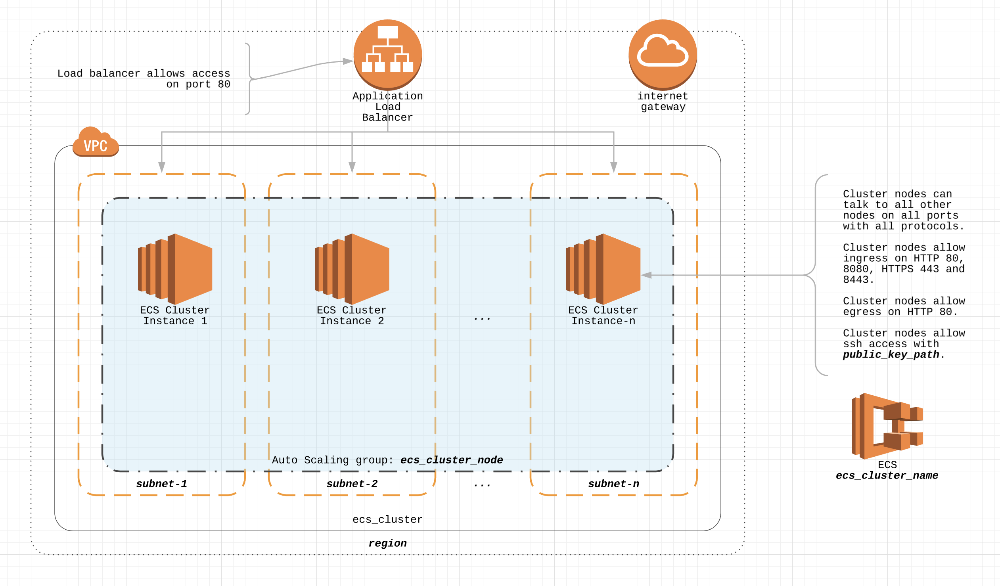
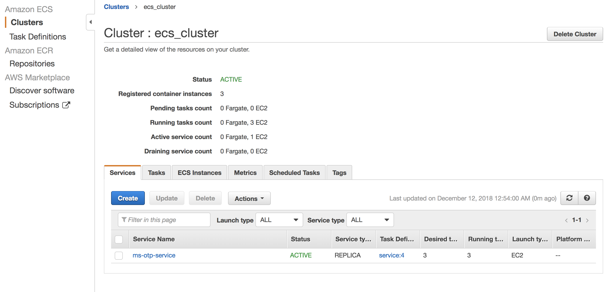

# terraform-aws-ecs-cluster

[](https://registry.terraform.io/modules/dwmkerr/ecs-cluster/aws)

Build an Amazon Elastic Container Services Cluster with Terraform.



## Introduction

This Terraform Module will create an AWS ECS cluster in a given region, spanning the provided availability zones.

## Quick Start

Terraform 0.11 or greater is required. The most simple configuration is below (the values used for the variables are actually the defaults, so could be omitted):


```
locals {
  region           = "ap-southeast-1"
  subnets          = {
  }
}

provider "aws" {
  region  = "us-east-1"
}

//  Create the ECS cluster using our module.
module "ecs_cluster" {
  source           = "dwmkerr/ecs-cluster/aws"
  region           = "us-east-1"
  instance_size    = "t2.small"
  vpc_cidr         = "10.0.0.0/16"
  subnets          = {
    us-east-1a = "10.0.1.0/24"
    us-east-1b = "10.0.2.0/24"
    us-east-1c = "10.0.3.0/24"
  }
  node_count       = "3"
  ecs_cluster_name = "ecs_cluster"
  key_name         = "ecs_cluster"
  public_key_path  = "~/.ssh/id_rsa.pub"
}
```

This will create an ECS cluster, made up of a set of three nodes in an auto-scaling group across the three availability zones specified. The screenshot below shows this cluster with a single service running in it:



More detailed examples are in the [`./examples`](./examples) directory. The basic example also shows how to add a Task, Service and Application Load Balancer Target Group to the service.

You can see the documentation for each of the variables on the [Module Inputs](https://registry.terraform.io/modules/dwmkerr/ecs-cluster/aws/?tab=inputs) page. The [Module Outputs](https://registry.terraform.io/modules/dwmkerr/ecs-cluster/aws/?tab=outputs) are also documented.
